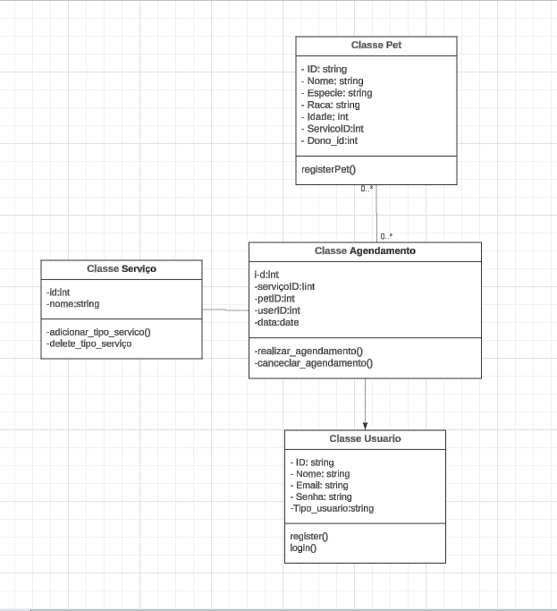

# API de Agendamento de Serviços Veterinários

Este projeto tem como finalidade o desenvolvimento de uma API destinada a uma clínica veterinária, com o objetivo principal de otimizar a gestão de serviços e melhorar o atendimento aos clientes. O sistema proporciona aos clientes a possibilidade de realizar seu cadastro, registrar seus pets e agendar serviços, como banho, tosa e vacinação. Além disso, um administrador terá acesso a funcionalidades específicas, permitindo a gestão dos serviços oferecidos, o controle dos agendamentos e a manutenção organizada da base de dados.

A API implementa autenticação por meio de JWT, garantindo a segurança das operações e a diferenciação dos níveis de acesso entre clientes e administradores. Para fins de prototipagem, o banco de dados poderá ser mantido em memória, e o projeto foi projetado para ser facilmente implantado utilizando Docker.

As funcionalidades do sistema foram definidas com base em histórias de usuário, priorizando a experiência dos clientes e a eficiência na administração da clínica, assegurando a adequação às necessidades dos envolvidos.

## 📖 **Histórias de Usuário**

### **1. Cadastro de Usuário (Admin)**  
**💡 Como admin**, quero cadastrar novos usuários no sistema da clínica informando nome, e-mail e senha, para que os novos usuários possam acessar as funcionalidades de cadastro de pets e agendamento de serviços.


---

### **2. Cadastro de Pet (Admin)**  
**💡 Como admin**, quero cadastrar os pets dos clientes informando nome, idade e espécie, para que eles possam ser vinculados aos serviços que os clientes desejam agendar.


---

### **3. Agendamento de Serviço (Cliente)**  
**💡 Como cliente cadastrado e com pet registrado**, quero agendar um serviço para meu pet escolhendo o tipo de serviço e a data/hora disponível, para garantir o atendimento no momento desejado.

---

### **4. Gerenciamento de Serviços (Administrador)**  
**💡 Como administrador da clínica**, quero poder cadastrar, editar ou excluir serviços disponíveis no sistema, para que as opções estejam sempre atualizadas e corretas para os clientes.

---

### **5. Gerenciamento de Usuários e Pets (Administrador)**  
**💡 Como administrador da clínica**, quero poder excluir usuários ou pets cadastrados no sistema, para remover dados desnecessários ou incorretos e manter o sistema organizado.

## Diagrama de Classe


## 📖 **Descrição do Diagrama de Classes**

O diagrama de classes ilustra a estrutura principal da API da clínica veterinária, com quatro entidades principais: **Usuário**, **Pet**, **Agendamento** e **Serviço**. 

- **Usuários** (clientes ou administradores) podem cadastrar pets e agendar serviços.  
- **Pets** estão vinculados a usuários e podem ter múltiplos agendamentos.  
- **Agendamentos** conectam pets a tipos de serviços, como banho ou vacinação.  

Essa modelagem garante organização e eficiência na gestão de dados do sistema.


## Tecnologias Utilizadas

- **Go (Golang)**: Linguagem de programação para desenvolver a API.
- **Gin-Gonic**: Framework para construção de APIs em Go.
- **JWT (JSON Web Tokens)**: Para autenticação e controle de acesso.
- **Banco de Dados Simulado em Memória**: Simula um banco de dados com dados persistentes durante a execução do servidor.

## **Restrições de Acesso por Nível de Usuário**

A API implementa um controle de acesso baseado no papel do usuário, identificado no token JWT. Cada tipo de usuário tem permissões específicas que determinam quais funcionalidades ele pode acessar. A seguir, estão detalhadas as permissões para **Administradores** e **Clientes**.

---

### **Somente Administradores podem acessar as seguintes funcionalidades:**

#### **Gerenciar Usuários:**
- **Criar novos usuários:** `POST /users`
- **Visualizar todos os usuários:** `GET /users`
- **Excluir usuários:** `DELETE /users/:id`

#### **Gerenciar Pets:**
- **Cadastrar novos pets:** `POST /pets`
- **Visualizar todos os pets:** `GET /pets`
- **Atualizar e excluir pets de qualquer cliente:** `PUT /pets/:id`, `DELETE /pets/:id`

#### **Gerenciar Serviços e Agendamentos:**
- **Excluir tipos de serviços:** `DELETE /service/:id`
- **Excluir agendamentos:** `DELETE /appointments/:id`

---

### **Somente Clientes podem acessar as seguintes funcionalidades:**

#### **Gerenciar seus próprios Pets:**
- **Visualizar as características de seus próprios pets:** `GET /pets/:id`
- **Atualizar informações de seus pets (como nome, idade, espécie):** `PUT /pets/:id`

#### **Agendamentos:**
- **Agendar serviços para seus pets:** `POST /appointments`
- **Listar seus próprios agendamentos:** `GET /appointments`

---

### **Restrições Importantes para Clientes:**
- **Clientes não podem:**
  - Gerenciar usuários.
  - Visualizar ou modificar informações de outros clientes ou seus pets.
  - Excluir dados do sistema.

---

## **Como Funciona a Autorização**

A autorização é baseada na verificação do token JWT enviado na requisição. O token contém as informações do usuário, incluindo seu papel (Admin ou Cliente). A API realiza a validação do token e, com base nas informações nele contidas, verifica se o usuário tem permissão para acessar a funcionalidade solicitada.

### **Passos da Autorização:**
1. **Autenticação:** O cliente envia o token JWT no cabeçalho `Authorization` da requisição.
2. **Validação do Token:** A API valida o token para garantir que ele seja válido e não tenha expirado.
3. **Verificação do Papel do Usuário:** A API verifica se o papel do usuário é `Admin` ou `Cliente` a partir dos dados contidos no token.
4. **Permissões:** Com base no papel do usuário, a API concede ou nega o acesso à rota solicitada.

Este processo garante que os dados e funcionalidades da API sejam acessados apenas por usuários autorizados, respeitando os limites de permissão para cada papel.

**Exemplo de código para validação de token:**

```go
Claims, err := auth.ValidateToken(c.GetHeader("Authorization"))
if err != nil {
    c.JSON(http.StatusUnauthorized, gin.H{"error": "invalid or expired token"})
    return
}
if Claims.Admin != true {
    c.JSON(http.StatusUnauthorized, gin.H{"error": "Access denied"})
    return
}
```

## Pré-Requisitos

Antes de rodar o projeto, você precisa ter instalado:

- [Go](https://golang.org/dl/) (versão 1.18 ou superior)
- [Docker](https://www.docker.com/products/docker-desktop) (se quiser rodar via Docker)

## Como Rodar o Projeto

### 1. Clonar o Repositório

Clone este repositório para a sua máquina local:

```bash
git clone https://github.com/seu-usuario/seu-repositorio.git
cd seu-repositorio

2. Instalar Dependências
Dentro do diretório do projeto, execute o comando abaixo para instalar as dependências:

bash
Copiar código
go mod tidy
3. Rodar a API Localmente
Para rodar a API localmente, execute:

bash
Copiar código
go run main.go
Isso iniciará o servidor na porta 8080 (você pode alterar a porta diretamente no código, se necessário).

4. Rodar a API com Docker
Para rodar a API usando Docker, siga as etapas abaixo.

4.1. Construir a Imagem Docker
bash
Copiar código
docker build -t api-agendamento .
(verificar sempre a versão do GO em go.mod e aversão do dockerfile)
4.2. Rodar o Contêiner Docker
bash
Copiar código
docker run -p 8080:8080 api-agendamento
Isso fará com que a API esteja acessível no endereço http://localhost:8080.

